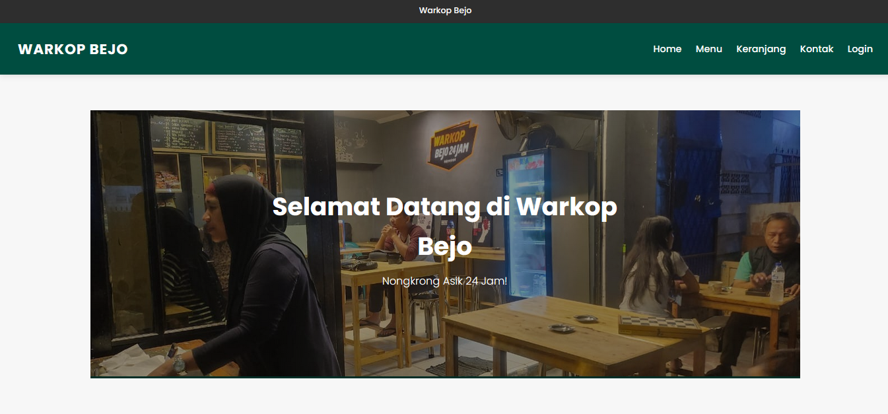

# ☕ Warkop Bejo - Website Pemesanan Kopi Sederhana

Selamat datang di markas besar proyek Website Warkop Bejo! Ini adalah proyek tugas kelompok untuk mata kuliah Pemrograman Web yang bertujuan untuk membuat aplikasi pemesanan kopi online yang fungsional dan modern, dibangun dengan PHP dan MySQL.



---

## ✨ Fitur Utama

* **Otentikasi Pengguna:** Sistem pendaftaran dan login yang aman.
* **Katalog Produk:** Tampilan menu produk yang dinamis langsung dari database.
* **Keranjang Belanja:** Fungsi untuk menambah, mengubah, dan menghapus pesanan.
* **Dashboard Pengguna:** Halaman profil untuk melihat data diri dan riwayat pembelian.

---

## 🛠️ Teknologi yang Digunakan

* **Frontend:** HTML, CSS, JavaScript
* **Backend:** PHP
* **Database:** MySQL
* **Server Lokal:** XAMPP

---

## 🚀 Panduan Instalasi & Menjalankan Proyek (Dari Awal Sampai Jalan)

Untuk menjalankan proyek ini di komputermu, ikuti 5 langkah mudah berikut.

### Langkah 1: Clone Repository ke Folder `htdocs`

Buka terminal atau Git Bash, masuk ke folder `htdocs` di dalam direktori instalasi XAMPP kamu, lalu jalankan perintah ini:

```bash
# Contoh path di Windows: cd C:/xampp/htdocs
# Contoh path di Mac: cd /Applications/XAMPP/htdocs

git clone [https://github.com/NasiGakPakeNasi/Pemrograman_Web.git](https://github.com/NasiGakPakeNasi/Pemrograman_Web.git)
````

**Penting:** Proyek ini **harus** berada di dalam folder `htdocs` agar bisa dijalankan oleh server Apache dari XAMPP.

### Langkah 2: Setup Database dengan Benar

1.  Nyalakan **Apache** dan **MySQL** dari XAMPP Control Panel.
2.  Buka browser dan akses `http://localhost/phpmyadmin`.
3.  Buat database baru dengan nama `warkop_bejo_db`.
4.  Pilih database `warkop_bejo_db` yang baru dibuat, lalu klik tab **"Import"**.
5.  Klik **"Choose File"** dan pilih file `warkop_bejo.sql` yang ada di folder utama proyek ini.
6.  Klik **"Go"** atau **"Import"**. Semua tabel akan otomatis dibuat.

### Langkah 3: Konfigurasi Koneksi Database (Jika Perlu)

Secara default, koneksi sudah diatur untuk XAMPP standar. Jika konfigurasimu berbeda, buka file `app/config/database.php` dan sesuaikan `DB_USERNAME` dan `DB_PASSWORD`.

### Langkah 4: Jalankan Proyek di Browser

Buka browser dan akses URL berikut:

`http://localhost/Pemrograman_Web/public/`

Selamat\! Website Warkop Bejo sekarang sudah berjalan di komputermu.

### Langkah 5: Selalu Update Proyekmu

Jika ada temanmu yang sudah menggabungkan (merge) fitur baru ke `main`, kamu bisa mendapatkan versi terbarunya dengan menjalankan perintah ini di terminal:

```bash
git checkout main
git pull origin main
```

-----

## 🤝 Panduan Kontribusi Tim (Aturan Main\!)

Ini adalah bagian terpenting. Agar kerja tim kita lancar dan tidak ada drama "kode hilang", semua anggota **wajib** mengikuti alur kerja ini.

1.  **Selalu `pull` Sebelum Mulai:** Pastikan kodemu yang paling baru (lihat Langkah 5 di atas).

2.  **Buat `branch` Baru untuk Setiap Tugas:** Jangan pernah kerja di `main`\!

    ```bash
    # Contoh: git checkout -b fitur-pembayaran-rafli
    git checkout -b nama-fitur-kamu
    ```

3.  **Kerjakan, `commit`, dan `push` Branch-mu:**

    ```bash
    # Setelah selesai ngoding, simpan pekerjaanmu
    git add .
    git commit -m "feat: Selesai membuat halaman pembayaran"

    # Kirim branch-mu ke GitHub
    git push origin nama-fitur-kamu
    ```

4.  **Buat *Pull Request* (PR) di GitHub:**

      * Buka halaman repositori di GitHub, kamu akan melihat notifikasi untuk membuat PR.
      * Beri judul yang jelas dan minta 1-2 teman untuk menjadi **"Reviewers"**.
      * Klik **"Create pull request"**.

5.  **Review & Merge:**

      * Teman yang ditunjuk akan me-review kodemu.
      * Jika sudah disetujui, salah satu dari kita akan menekan tombol hijau **"Merge pull request"**.
      * **Hore\!** Kodemu sudah resmi menjadi bagian dari proyek utama.

-----

## 🧑‍💻 Tim Pengembang

  * **Menu Utama:** W***n
  * **Produk/Menu:** B***s
  * **Keranjang:** R***y
  * **Pembayaran:** R***i
  * **Struk:** D***a
  * **Profil/Dashboard & Auth:** V**o

<!-- end list -->

```
```
